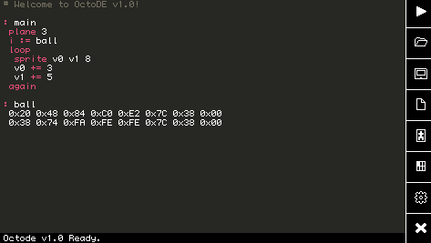

C-Octo
======


This project is a rewrite of the web-based [Octo](https://github.com/JohnEarnest/Octo) CHIP-8 development toolkit in C. This port can run on a wide variety of older or lower-powered devices which would struggle with a modern web browser. C-Octo also provides an enhanced CLI and offline experience for those who prefer to use an external text editor.

The C-Octo suite includes `octo-cli`, a command-line compiler, `octo-run`, a minimal runtime and debugger that can be executed from the command-line, `octo-de`, a self-contained "Fantasy Console"-style programming environment, and several reusable libraries. Why not give Octo a spin on the _PocketCHIP_ gathering dust in your closet?

Project Structure
-----------------
C-Octo is split into several files by function:

- `octo_compiler.h`: a freestanding compiler for [Octo Assembly Language](https://github.com/JohnEarnest/Octo/blob/gh-pages/docs/Manual.md).
- `octo_emulator.h`: a CHIP-8, SCHIP, and XO-CHIP compatible emulator core which performs no IO.
- `octo_cartridge.h`: routines for reading and producing "Octocarts", which encode both an Octo program and configuration metadata into a GIF image.
- `octo_util.h`: assorted support routines shared by `octo_run.c` and `octo_de.c`.
- `octo_cli.c`: a minimal interface for the Octo compiler which depends only upon the C standard library and `<sys/stat.h>`.
- `octo_run.c`: a minimal graphical frontend for the Octo emulator and compiler which depends on SDL2.
- `octo_de.c`: a richer graphical frontend including a text editor, sprite editor, and other conveniences.

Installation
------------
To build from source you will need a C compiler and (probably) [SDL2](https://www.libsdl.org/index.php). The provided Makefile will build everything, attempt to copy binaries to `/usr/local/bin/`, and create a configuration `.octo.rc` file in your home directory.

For detailed information about building and installing on different platforms, see the [Build Guide](docs/BuildGuide.md).

Octo-CLI
--------
```
$octo-cli
usage: ./octo-cli <source> [<destination>] [-s <symfile>]
```
The `source` file may be a `.8o` source file or a `.gif` octocart. If the `destination` has a `.ch8` extension, a CHIP-8 binary will be produced. If the destination has a `.gif` extension, an octocart will be produced. If the `destination` has a `.8o` extension, the source text of an input octocart will be extracted. If no destination is specified, the resultant `.ch8` binary will be piped to _stdout_.

if the `-s` flag is provided, the compiler will write out a CSV file containing all the _symbols_ defined in the input program: breakpoints, constants (including labels), aliases, and monitors, for use with external debugging tools. For example:

```
$ cat symdemo.8o
:monitor v6 8
: main
	:alias acc v2
	acc += 1
	:breakpoint "wait, then go"
	acc := 0

$ octo-cli symdemo.8o temp.ch8 -s syms.csv && cat syms.csv
type,name,value
breakpoint,"wait, then go",514
constant,main,512
alias,unpack-hi,0
alias,unpack-lo,1
alias,acc,2
monitor,v6,8
```

The `make testcli` target will run a series of integration tests for this tool.

Octo-Run
--------
```
$octo-run
octo-run v1.0
usage: ./octo-run <source> [-c <path>]
where <source> is a .ch8 or .8o
```
Octo-run will execute a `.ch8` binary or compile and run an Octo program. While executing, the same basic debugging features are available as in web-octo: `i` toggles a user interrupt and the display of the register file, `o` single-steps while interrupted, and `m` toggles the display of memory monitors, if any are registered. Command-F or Ctrl-F toggle fullscreen mode and Escape or backtick quit.

If provided, the `-c` flag may be used to indicate a configuration file which should override the global `.octo.rc` file. This makes it easier to configure colors, speed, and other options for an individual program while working on multiple projects.

If a gamepad is detected, axes will be mapped to mirror `A`,`S`,`W`, and `D` on the keyboard and buttons will similarly be mapped to `E` and `Q`.

Octode
------
```
$octo-de
```
Octode includes a text editor, sprite editor, palette editor, and a runtime/debugger identical to `octo-run`. With the exception of the sprite editor, the user interface can be controlled entirely via the keyboard, and should work equally well with a mouse or touchscreen. For detailed information about Octode, see the [Octode User Guide](docs/OctodeUserGuide.md).

Configuration File
------------------
Octo-run and Octode look for a file named `.octo.rc` in the user's home directory. If present, it can be used to configure a variety of useful settings for the tools. The file has a traditional `.INI` structure- empty lines or lines beginning with `#` are ignored, and anything else consists of a key and value separated by `=`. Meaningful keys are as follows:

- `ui.windowed`: if `1`, the tool runs in a window. If `0`, it will attempt to run in fullscreen.
- `ui.software_render`: if `1`, prefer a software renderer over hardware-acceleration. On some low-power devices, "accelerated" mode is unusably slow!
- `ui.win_scale`: if greater than `1`, scale up the "logical" window dimensions by an integer factor.
- `ui.win_width`: horizontal size in pixels when in windowed mode.
- `ui.win_height`: vertical size in pixels when in windowed mode.
- `ui.volume`: volume of XO-CHIP sound (0-127). A value of `0` will disable audio entirely.

- `core.tickrate`: number of CHIP-8 instructions to execute per 60hz frame.
- `core.max_rom`: the maximum number of bytes the compiler will permit when assembling a ROM.
- `core.rotation`: one of {`0`, `90`, `180`, `270`} to rotate the CHIP-8 display. Does not impact the rest of the UI.
- `core.font`: one of {`octo`, `vip`, `dream_6800`, `eti_660`, `schip`, `fish`} to select the built-in CHIP-8 font.

- `color.plane0`, `color.plane1`, `color.plane2`, `color.plane3`: colors for the 4 XO-CHIP "plane" colors.
- `color.background`: the border drawn behind the CHIP-8 display when no sound is being played.
- `color.sound`: the alternate border color when sound is being played.

- `quirks.shift`: if `1`, `vx <<= vy` and `vx >>= vy` modify `vx` in place and ignore `vy`, like SCHIP.
- `quirks.loadstore`: if `1`, `load` and `store` do not post-increment `i`, like SCHIP.
- `quirks.jump0`: if `1`, emulate a buggy behavior of SCHIP on the HP-48: the 4 high bits of the target address of `jump0` determines the offset register used (instead of always `v0`).
- `quirks.logic`: if `1`, clear `vf` after `&=`,`|=` and `^=`. On the VIP, these instructions leave `vf` in an unknown state.
- `quirks.clip`: if `1`, do not "wrap" sprite drawing around the edges of the display.
- `quirks.vblank`: if `1`, drawing a sprite will block until the end of the 60hz frame, like the VIP.

All colors are specified as 6-digit RGB in hexadecimal, like `996600`. The default quirks settings, palette, and other options correspond to those of web-octo.
