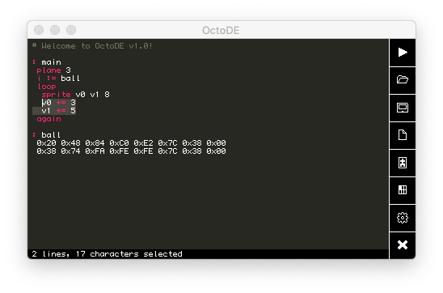
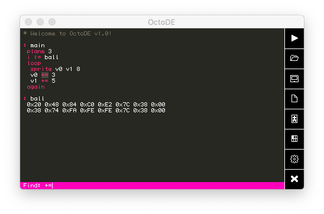
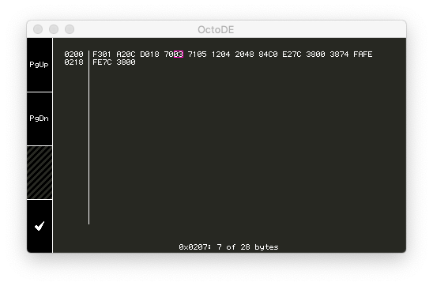
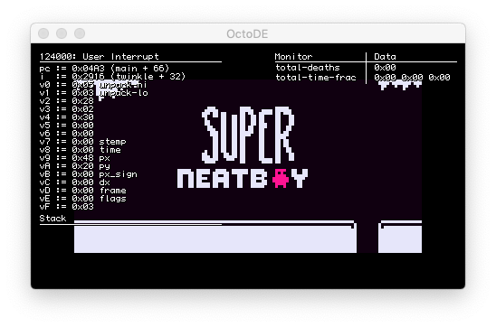
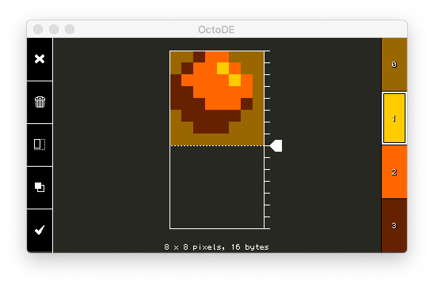
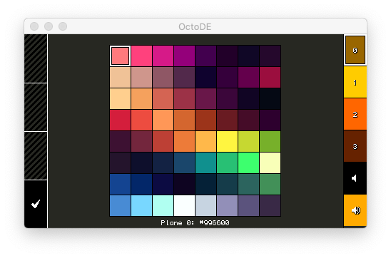
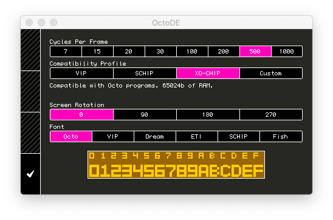
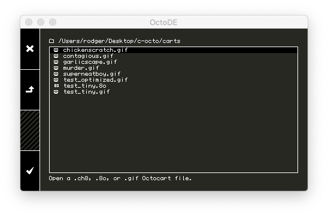
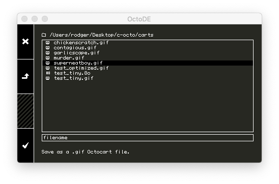

Octode User Guide
=================
This document explains the features and UI of Octode. You may want to familiarize yourself with [Octo](https://github.com/JohnEarnest/Octo), especially its [Assembly Language](https://github.com/JohnEarnest/Octo/blob/gh-pages/docs/Manual.md) before using Octode.


Octode is composed of several screens. When it starts up, you're looking at the _Text Editor_ screen. On a Macintosh keyboard, the "Command" key will behave the same as "Ctrl" in all the keyboard shortcuts described here.

Text Editor
-----------


The Text Editor is the heart of developing Octo programs, and your jumping-off point to access other tools and features. Along the bottom edge of the display is a status bar, which normally provides information about the current selection. Along the right edge are a series of buttons which access other screens. From top to left, the icons are _Run_, _Open_, _Save_, _New_, _Sprite Editor_, _Palette Editor_, _Configuration_, and _Exit_.

The following keyboard shortcuts are available:

- Arrow keys move the cursor by one character.
- `Ctrl`+Arrow keys move the cursor by entire spans of characters or whitespace.
- `Home`/`End` move the cursor to the beginning or end of the line, respectively.
- `PageUp`/`PageDown` move the cursor vertically by a screenful.
- Holding `Shift` while using arrow keys, `Home`, `End`, `PageUp`, or `PageDown` will select a region of text.

You can also move the cursor or select text by using the mouse, and use a mouse scroll wheel or touchpad scroll gestures to scroll the display.

- `Escape`: Quit Octode.
- `Ctrl`+`c`: Copy selection to clipboard.
- `Ctrl`+`x`: Cut selection to clipboard.
- `Ctrl`+`v`: Paste clipboard to selection.
- `Ctrl`+`r`: Compile and run. Any error messages will be shown in the status bar and move the cursor to the offending token.
- `Ctrl`+`b`: Toggle fullscreen mode.
- `Ctrl`+`o`: Open a document.
- `Ctrl`+`s`: Save the current document.
- `Ctrl`+`s`+`Shift`: Save the current document with a new name/path.
- `Ctrl`+`n`: Start a New document.
- `Ctrl`+`e`: Open the sprite editor. If you have text selected, it will be used as data for the current sprite.
- `Ctrl`+`p`: Open the palette editor.
- `Ctrl`+`f`: Find. If you have text selected, it will be used as the search term.
- `Ctrl`+`/`: Toggle commenting for the current (or selected) line(s).
- `Tab`: Indent the selected line(s).
- `Tab`+`Shift`: Unindent the selected line(s).

In _Find_ mode, the status bar is replaced by a search term. As you type, the selection cursor will move to the first result in the document:



Arrow keys cycle between search results. Pressing `Enter` or `Escape` will exit find mode and leave the cursor at the last found result.

Dump
----


If a program has been compiled successfully, you can click the status bar to open a hex dump of the CHIP-8 binary. Addresses are shown along the left edge of each row.

Arrow keys, the PageUp/PageDown keys, and a mouse scroll wheel may be used to navigate the dump. Click any byte to highlight it and see its address.

Run
---


While a program is running, your keyboard is mapped to the CHIP-8 hex keypad as follows:
```
Chip-8 Key  Keyboard
----------  ---------
  1 2 3 C    1 2 3 4
  4 5 6 D    q w e r
  7 8 9 E    a s d f
  A 0 B F    z x c v
```

Additionally, the arrow keys are aliased to `a`/`s`/`w`/`d` and space is aliased to `e`. For convenience on the _PocketCHIP_ keyboard, `Backspace` is another alias for `e`, and `F12` is another alias for `q`.

If a gamepad is available, it will likewise alias the sticks to `a`/`s`/`w`/`d` and buttons to `e` and `q`. Modern CHIP-8 programs are strongly encouraged to use corresponding key layouts when possible.

When a program is interrupted by a `:breakpoint` or pressing `i`, the register file will appear on the left side of the display. From top to bottom, this indicates the number of cycles executed and the name of the breakpoint, the value of the program counter and index register (shown as an offset from the closest known label, if any), the value of each `v`-register, and the contents of the CHIP-8 stack. While interrupted, pressing `o` single-steps and `i` resumes.

Pressing `m` toggles showing any monitors (defined with `:monitor`) on the right side of the display.

Pressing `Escape` will return to the _Text Editor_.

Sprite Editor
-------------


The sprite editor is a convenient way to create manipulate image data for Octo programs. From top to bottom, the icons on the left menu are _Cancel_, _Clear_, _Toggle Size_ (switch between CHIP-8 _8xN_ mode and SCHIP _16x16_ mode), _Toggle Color_ (switch between 1-bit and XO-CHIP bitplane mode), and _Confirm_.

If the sprite editor is in 8xN mode, it will include a slider for selecting the height of the sprite. This is useful both for measuring existing sprites and ensuring that color sprites have the correct stride.

If the sprite editor is in color mode, it will include palette swatches for the XO-CHIP plane colors on the right edge. The number keys 1-4 may be used to select a color, or `Tab`/`Shift+Tab` may be used to cycle between colors. If using a mouse as a pointing device, right click will always erase. In monochrome mode, left clicking will toggle pixels instead of painting with the plane-1 color.

If the sprite editor was opened with a selection of text, it will do its best to interpret an appropriate combination of color and size settings based on the number of bytes selected. When such a sprite is "Confirmed", the sprite editor will attempt to reconstitute the data with the base and whitespace of the original.

- `Escape` leaves the sprite editor without making changes to your program (_Cancel_).
- `Enter` leaves the sprite editor and pastes its contents into the editor (_Confirm_).

Palette Editor
--------------


The palette editor allows you to quickly choose a vibrant color scheme for your program. Click on a color on the right menu to select it, and then click on a swatch to choose that color. The arrow keys can quickly navigate between swatches. As in the sprite editor, The number keys 1-6 may be used to select a color, or `Tab`/`Shift+Tab` may be used to cycle between selected colors.

Pressing `Escape` or `Enter` leaves the palette editor.

Configuration
-------------


The configuration panel allows you to change some of the behavior of the emulator. Click on the option bars to choose emulation speed, a compatibility profile (the COSMAC VIP, SCHIP on the HP-48, or Octo's defaults), screen rotation modes, and the built-in font.

An emulation speed of 7-15 is roughly historically accurate for the VIP, and 20-30 is a good estimate for SCHIP. XO-CHIP programs are free to use 1000, but should try to run at the lowest speed they can manage.

Pressing `Escape` or `Enter` leaves the configuration panel.

Open and Save
-------------


In the _Open_ and _Save_ screens, the menu on the left has icons to _Cancel_, _Move Up_ (navigate to the parent directory, if any), and _Confirm_. The arrow keys or mouse may also be used to navigate directories.

Opening an Octocart will load both source code and all metadata for the file. A `.8o` text file contains only source code. Opening a `.ch8` binary will convert it into Octo-compatible source code.



When saving, you can type to enter a filename, or double-click an item to choose its name.

- `Escape` leaves the dialogue.
- ``` ` ``` (Backtick) navigates to the parent directory.
- `Enter` with a directory selected opens that directory.
